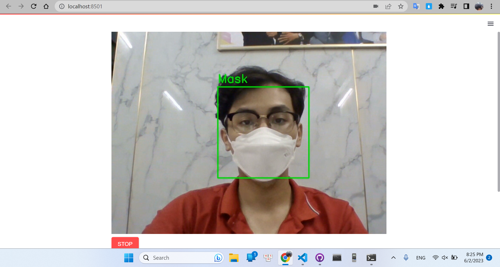
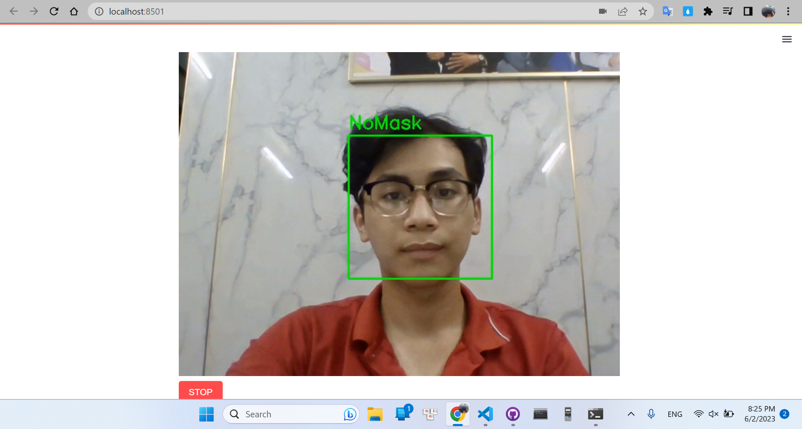

# Face Mask Classification using Haar Cascade and MobileNet V2

This project aims to develop a face mask classification system using Haar Cascade and MobileNet V2 deep learning models. The system can determine whether a person is wearing a face mask or not, based on the input image or video.

 ---

### **INTRODUCTION**
In the wake of the COVID-19 pandemic, face masks have become an essential part of our daily lives to prevent the spread of the virus. Automating the process of face mask detection can be crucial in ensuring compliance with safety guidelines in various settings such as public places, workplaces, and transportation.

This project leverages two powerful deep learning models: Haar Cascade and MobileNet V2. Haar Cascade is a machine learning-based approach that can detect faces in real-time by analyzing the features present in the image. MobileNet V2, on the other hand, is a lightweight convolutional neural network architecture known for its efficiency and accuracy in image classification tasks.

Technologies I used:
  - [Streamlit](https://streamlit.io/) to create a simple web demo.
  - [Streamlit_webrtc](https://pypi.org/project/streamlit-webrtc/) to use real-time camera on Streamlit.
  - [Tensorflow](https://www.tensorflow.org/) to build a deep learning model.
  - [OpenCV](https://opencv.org/) doing tasks relate to Computer Vision.
  - [Sci-kit Learn](https://scikit-learn.org/stable/) to process data.
  - [Streamlit documentation](https://www.youtube.com/playlist?list=PLtqF5YXg7GLmCvTswG32NqQypOuYkPRUE) to learn the basic of streamlit.

---

### **INSTALLATION**
I highly recommend you using Google Colab to run the Face_Mask_Detection.ipynb file because it already has packages and libraries I use. But if you want to run on your local machine, following the instruction below.
  - Install essential libraries and packages:
  
  ```
  pip install -r requirements.txt
  ```

---

### **DATA INFORMATION** 

This data 2 classes: Mask or WithoutMask

Mask: 1915 images

WithoutMask: 1918 images

---

### **MOBILE NET V2**

MobileNet V2 is a lightweight and efficient convolutional neural network (CNN) architecture designed for computer vision tasks. MobileNet V2 utilizes depthwise separable convolutions, making it ideal for applications on mobile devices and embedded systems. With its compact design and impressive performance, MobileNet V2 is a popular choice for tasks such as image classification, object detection, and semantic segmentation. This README provides an overview of using MobileNet V2 for the task of facial mask classification using Haar cascade and MobileNet V2.

---

### **DEMO**
  - Run demo:
  
  ```
  streamlit run app.py
  ```

When the demo is starting, press the button START to run the demo.

---

### **RESULT**

A demo will return a traffic sign's class.



